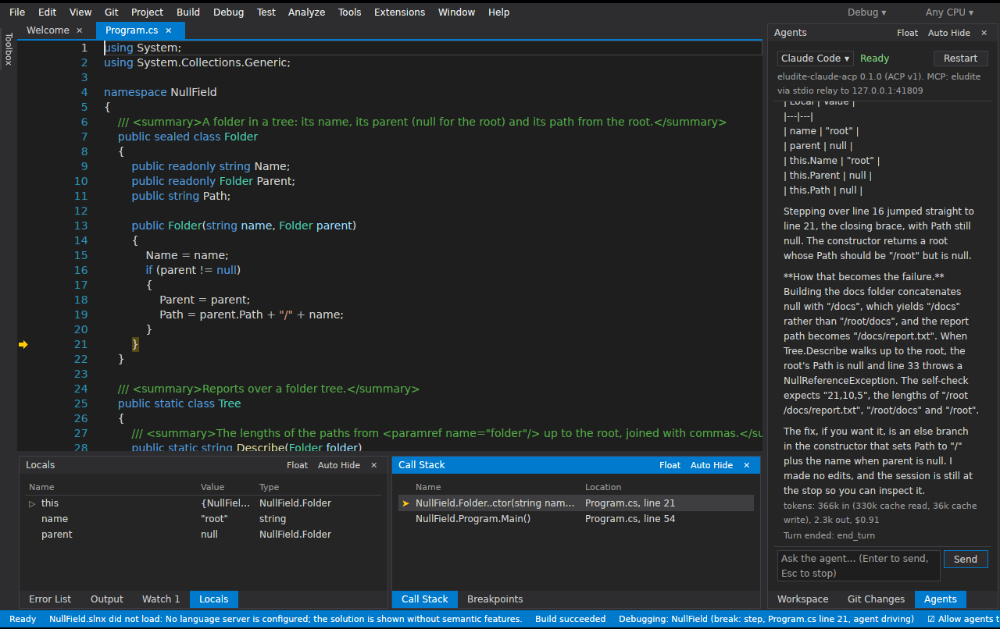
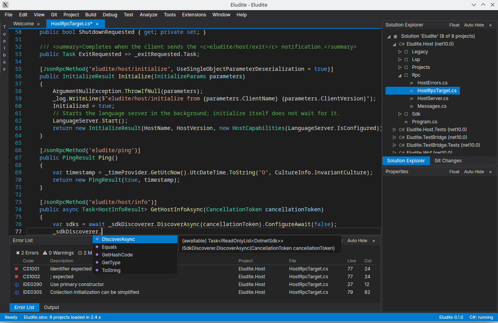

# Eludite

Eludite is a native, cross-platform IDE for .NET, the web stack and Rust, built so that coding agents and the person at the keyboard work through the same interface.

It is .NET-first, not .NET-only. The first-class workloads are .NET in all its languages (C#, F#, VB.NET), including .NET Framework, WebForms and WCF; TypeScript, JavaScript and the front-end stack; and Rust. The layout, window names and shortcuts are the ones most .NET developers already know, so nothing has to be relearned on day one.

The shell is written in Rust on GPUI and draws its own UI. Roslyn, MSBuild, debuggers, test runners, the browser engine and agents each run in their own process, so a hung analyzer cannot freeze the editor. Every user-visible action is a command on one bus with a JSON schema; the menus call it, and so do agents over MCP. The shell speaks open protocols (LSP, DAP, the testing platform protocols, ACP, MCP) rather than a plugin API of its own.

Eludite was called Niello until 2026-10-02.





## Status

Pre-alpha. It opens, edits, builds and debugs real solutions on Linux, but it is not yet anyone's daily editor.

Work is issued and recorded as briefs, each with a report, in [docs/briefs/](docs/briefs/). The index there is the authoritative status. In short:

- Phase 0 (the spikes that decided the architecture) is complete on Linux and Windows.
- Phase 1 (a daily driver for modern .NET) has landed the editor core, docking, opening a solution, IntelliSense, navigation, rename and code actions, build with the Error List, run and debug, Test Explorer, git, the integrated terminal, Find in Files and Replace in Files, the Agents window, Rust through the generic paths, and settings.
- Phase 2 work that was pulled forward: the agent debugging suite (inspection, run control, attach, multiple sessions, a recorded conformance corpus and a proving scenario with a real agent), .NET Framework debugging on Linux and macOS under Mono, Rust debugging with lldb-dap, browser automation over the Chrome DevTools Protocol, and the embedded browser engine.

macOS builds in CI; nothing has been measured there yet.

## Build

Toolchains are pinned: Rust 1.98.1 by `rust-toolchain.toml`, .NET SDK 10.0.302 by `global.json`.

Shell (Rust workspace):

```
cargo build --workspace
cargo test --workspace
cargo clippy --workspace --all-targets -- -D warnings
cargo fmt --check
```

Host (.NET):

```
dotnet build dotnet/Eludite.slnx
dotnet test dotnet/Eludite.slnx
```

GPUI is a git dependency at a pinned revision, so the first build fetches it.

Linux system packages for the GPUI build:

- Debian/Ubuntu: `libwayland-dev libxkbcommon-x11-dev libvulkan-dev libfontconfig1-dev libssl-dev libgit2-dev pkg-config cmake clang`
- Arch: `wayland libxkbcommon vulkan-icd-loader fontconfig openssl libgit2 pkgconf cmake clang`

Optional pieces. Each is located on the machine at run time, never bundled, and its tests skip when it is absent:

- Mono, to debug .NET Framework programs with `eludite-dbg-mono`: `mono-devel` on Debian/Ubuntu, `mono` on Arch, the Mono framework package on macOS.
- lldb-dap, to debug Rust: `lldb-18` on Debian/Ubuntu, `lldb` on Fedora and Arch, Xcode on macOS, LLVM's installer on Windows ([tools/lldb-dap/README.md](tools/lldb-dap/README.md)).
- netcoredbg, to debug .NET 5+: `tools/netcoredbg/fetch.sh`.
- vscode-js-debug, to debug the JavaScript and TypeScript of pages in the Web Browser window: `tools/js-debug/fetch.sh` fetches the pinned release by checksum (under `~/.cache/eludite/js-debug/`), and it runs on the Node.js 18 or later found on the machine; `export ELUDITE_JS_DEBUG="$(tools/js-debug/fetch.sh)"` runs its real tests.
- The Test Explorer's corpus of small test projects: `corpus/tests/build.sh` (`build.ps1` on Windows) builds them in place so the host's and the shell's Test Explorer tests run against them.
- The embedded browser engine `eludite-chromium` (Linux so far). Fetch CEF (326 MB, 558 MB unpacked, under `~/.cache/eludite/cef/`) and build with the `cef` feature; without it the workspace build downloads nothing ([tools/cef/README.md](tools/cef/README.md)):

```
export CEF_PATH="$(tools/cef/fetch.sh)"
cargo build --workspace --features eludite-chromium/cef
```

Windows and macOS need no extra system packages beyond the Rust and .NET toolchains. `debuggers/netfx` compiles on every OS but only runs on Windows; `debuggers/mono` builds everywhere and runs under Mono on Linux and macOS.

A machine with no display can still run the shell and its UI tests under Xvfb with Mesa's software Vulkan; see `crates/eludite/tools/xvfb-linux.sh`.

## Documents

- [docs/PLAN.md](docs/PLAN.md): the plan, and the source of truth for scope and phases
- [docs/adr/](docs/adr/): architecture decision records
- [docs/proposals/](docs/proposals/): designs for features the plan names but does not detail
- [docs/briefs/](docs/briefs/): the units of work, with a report for each one done
- [docs/agents/](docs/agents/): guides served to agents inside the IDE, such as how to drive the debugger
- [CLAUDE.md](CLAUDE.md): the rules every agent working in this repository follows
- [CONTRIBUTING.md](CONTRIBUTING.md): how to contribute

## License

- Product (shell, hosts, debuggers, web tooling): GPL-3.0-or-later, see [LICENSE](LICENSE).
- `protocol/` and `extension-sdk/`: MIT, so anyone can write an agent, extension or alternative host against Eludite under any license.
- Contributions are accepted under the Developer Certificate of Origin. There is no CLA.
