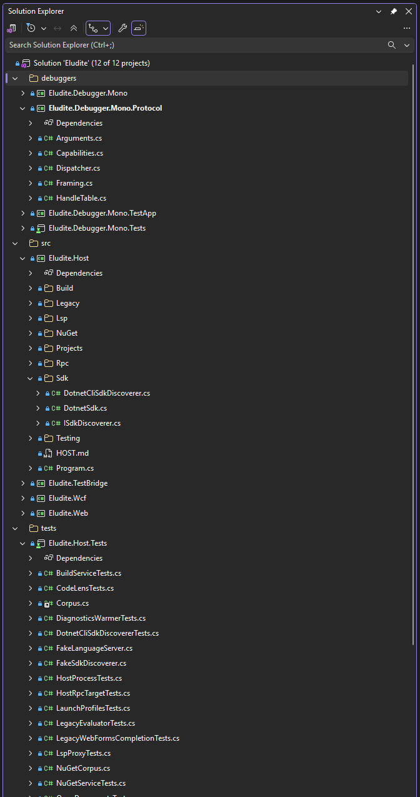

# Brief 0062 report: the Workspace window's Visual Studio look

Status: implemented and tested on Linux (uncommitted); the four screenshots are owed (section 6): the driver is
written, not run here. Windows and macOS: not run. CI: not run (nothing pushed). The .NET SDK is not installed here, so
`dotnet build` and `dotnet test` were not run; this brief changes no .NET code. No file outside the brief's list was
edited.
Branch: `brief/0062-workspace-window-visual-studio-look`, based on `main` at `f86ede6` with briefs 0057 to 0060's
uncommitted work applied on top.
Date: 2026-10-05. Brief: [0062-workspace-window-visual-studio-look.md](0062-workspace-window-visual-studio-look.md).

## 1. Summary

- **Schemas first.** `protocol/schemas/workspace-search.input.json` (`query?`, at most 1,000 characters, empty
  clears; `focus?`, Ctrl+;'s) and `workspace-search.output.json` (`query`, `rows: [{path?, name, kind}]` at most 500,
  `total`, `truncated`; `kind` is one of 14 names).
- **The command** (`crates/commands/src/workspace.rs`): `eludite.workspace.search`, agent-visible, class `read`,
  `WorkspaceSearchInput`/`Row`/`Output`, the `WorkspaceSearchTarget` trait and `register_search`, which caps the rows
  at 500 and sets `truncated`. It is registered on its own (not one of `workspace::ALL`), so the shell's exhaustive
  `WorkspaceRequest` match is untouched.
- **The icon set** (`crates/ui/icons/*.svg`, 47 files, each 16 by 16 with `viewBox="0 0 16 16"`, the largest 656
  bytes): our own drawings in Visual Studio's metaphors, listed with their meaning in `crates/ui/src/icons.rs`'s module
  docs, which also hold the drawing rules. `icons::Icon` (one variant per file, `ALL`, `name`, `path`, `bytes`,
  `colored`, `tint`), `icons::Assets` (the `gpui::AssetSource` over `include_bytes!`, `icons/<name>.svg`) and
  `icon(Icon, color)` (`svg().path(..)` 16 by 16 with `text_color` for a monochrome icon, `img(..)` for a colored one).
- **Theme tokens** (`crates/ui/src/theme.rs`, all three themes): `icon_folder`, `icon_csharp_file`,
  `icon_csharp_project`, `icon_rust`, `icon_json`, `icon_markdown`, `icon_xml`, `icon_web`, `icon_package`,
  `icon_dependencies`, `icon_solution`, `icon_muted`. VS Dark starts from the brief's values (`DCB67A`, `A179DC`,
  `3BA25A`, `CBCB41`, `519ABA`, `E37933`, `6DAEE1`, `519ABA`, `A179DC`) plus `DE7A4A` (Rust), `4FA6E0` (web) and
  `9D9D9D` (muted); VS Light and VS Blue use the same hues darkened (`A87B1E`, `7B4DB3`, `2E7D32`, `B5451B`, `8A7A00`,
  `2F6F9F`, `B4530C`, `1F6FB2`, `1C6EA4`, `2F6F9F`, `6F42B0`, `6E6E6E`) so each reads at 3:1 on its panel (the lowest:
  the folder, 3.49 on Light's `F5F5F5`).
- **Tree rows** (`crates/ui/src/tree.rs`): `tree_row_with_icon` leads with an icon and its tint, keeps brief 0040's
  badge slot between the icon and the label, and draws a search's matched byte ranges bold in the `guide` color (bold
  only on the selected row). `tree_row` and `tree_row_with_badge` (the References and CodeLens windows) are unchanged
  for their callers; all three share one row builder, so the row height stays `TREE_ROW_HEIGHT`.
- **The model** (`crates/workspace/src/explorer.rs`): `FileType` and `file_type_of` (by extension, case-insensitive,
  lockfiles first) and `Row::file_type`; the no-duplicates rule (section 2).
- **The Workspace window** (`crates/eludite/src/shell/explorer.rs`): `row_icon` (the brief's `NodeKind` table; a .NET
  project is the test variant when its Dependencies node references `Microsoft.NET.Test.Sdk`, xunit, xunit.v3,
  MSTest, NUnit, TUnit or Microsoft.Testing.Platform) and `file_icon`; the search box under the title (a single-line
  `TextInput` with "Search Workspace (Ctrl+;)", the magnifier, the clear button while it has text); the search
  (`match_ranges`, `search_rows`, the search's own expanded set, the saved expanded set restored by Escape or an empty
  query); `register_search`, `link_search` and `bind_keys` (Ctrl+;).
- **Process wiring** (`crates/eludite/src/app.rs`): `Application::with_assets(icons::Assets)`, `register_search` on
  the bus before the window opens (the registry registers through `&self`), `link_search` on the shell's explorer, and
  `explorer::bind_keys` beside the other `bind_keys`.
- **The screenshot driver**: `crates/eludite/tools/workspace-look-linux.sh` (section 6).

## 2. Decisions and findings

- **GPUI's `svg()` is monochrome.** At rev `20d29fc` `svg()` rasterizes a file into an alpha mask
  (`SvgRenderer::render_alpha_mask`) and paints it as one `MonochromeSprite` in `text_color`: a file's own colors are
  lost. So the brief's two kinds became: monochrome icons (46 of 47) drawn in `currentColor` with depth from
  `fill-opacity` and knocked-out letters (a mask), tinted per theme by the tokens above; and colored icons drawn with
  `img()` (resvg in full color, cached by GPUI's image cache), today only `project-unavailable` (dashed grey `808080`
  with the red `D13438` error badge and a white cross). Its two colors read at 3:1 or better on all three panels (the
  test checks), so **no icon needed a `-light` variant**. The monochrome route gives the brief's tokens their meaning:
  a theme recolors every icon.
- **Nothing listed twice.** Today's rule (a listed file under a project's or package's folder is not listed again)
  compared paths as spelled, so a workspace opened through a symlink or a `..` path (`dotnet/../dotnet`), against the
  host's and cargo's real paths, listed every project's files again under plain folders at the root. The model now
  compares canonical paths: the root is resolved once (`std::fs::canonicalize`), the listing's files are rebased onto
  it by name (no system call per file), the projects' and packages' folders are resolved once each; a solution
  project's file is an owned file too; a folder holding only projects disappears with its files; a project the host
  lists twice is one node and is counted once in `Solution 'X' (n of m projects)`. A package's files keep the listing's
  spelling (so their folders still open). `eludite.workspace.tree` already answered each project once (the shell's
  `publish_workspace_tree` lists the host's projects and the Cargo members); the shell test proves it.
- **The search** matches the label the row shows (so `Eludite.Host (net10.0)` matches `host`), every word of the query
  somewhere in it, case-insensitively (an ASCII fast path, a Unicode path that maps the lowercase back to the label's
  bytes). The tree shows the matches and their ancestors, expanded; a node that leads to a match shows only its kept
  children, and a match the person expands shows all of its children. Toggles during a search change the search's
  own expanded set; Escape (or an empty query, or the clear button) restores the set from before. A refreshed tree
  re-runs the box's query. The 150 ms debounce compares with the last query asked for, so the command's immediate
  search is not cancelled by its own text change.
- **The match highlight** uses the theme's `guide` color, as the completion list does (the brief says "accent"; VS
  Blue's accent `FFF29D` is unreadable on its white panel).
- **`eludite.workspace.search`** answers on the invoking thread from a shared index (`Arc<RwLock<SearchIndex>>`, the
  tree's rows in order with their parents, rebuilt on every new model) and hands the box's change to the UI thread
  through a channel without waiting, so Ctrl+; (the UI thread) and an agent (a server thread) take the same path and
  neither blocks. `focus` also runs `eludite.view.show {id: "workspace"}` so a hidden Workspace window comes forward.
- **Solution folders.** The host's tree (`eludite/solution/tree`) has no solution folders, so the window cannot show
  `.slnx` folders; the `solution-folder` icons exist for when it does (out of scope: "any change to the tree's model").

## 3. Proving tests

| Test | Where | Result |
|---|---|---|
| every icon has a 16 by 16 file under 2 KB that parses (GPUI's `SvgRenderer`, rendered at 32 by 32 with pixels drawn) and the asset source serves it | `eludite-ui` `icons::tests::every_icon_has_a_16_by_16_file_that_parses_and_the_asset_source_serves_it` | pass |
| monochrome icons use `currentColor` and no fixed color; colored ones have at most three colors, each at 3:1 on every theme's panel | `icons::tests::monochrome_icons_use_current_color_and_colored_ones_read_on_every_panel` | pass |
| every icon's tint reads at 3:1 in every theme | `icons::tests::every_icon_has_a_tint_in_every_theme` | pass |
| the three themes define every icon token, each at 3:1 on `panel` (brief 0059's readability test, extended); VS Dark's starting values | `theme::tests::text_is_readable_in_every_theme`, `vs_dark_is_default` | pass |
| the command answers its schema, caps 700 rows at 500 with `truncated`, `""` answers nothing, rejects bad input | `eludite-commands` `workspace::tests::search_answers_its_schema_caps_the_rows_and_rejects_bad_input` | pass |
| file types by extension, case-insensitive (32 names), `Row::file_type` | `eludite-workspace` `explorer::tests::file_types_by_extension_case_insensitively` | pass |
| a root spelled through `..` and through a symlink: each project once, no `src`/`tests` folder, a twice-listed project once | `explorer::tests::nothing_is_listed_twice_whatever_the_spelling_of_the_root` | pass |
| the icon for every `NodeKind` (and each Cargo target kind); every file type its own icon | `eludite` `shell::explorer::tests::every_node_kind_has_its_icon` | pass |
| 28 file names (20 extensions and more) to their icons | `files_get_their_icon_by_extension_case_insensitively` | pass |
| match rules: case, every word, merged ranges, non-ASCII | `matches_are_case_insensitive_every_word_must_match_and_ranges_merge` | pass |
| the change glyph on a modified file, in the badge slot after the icon; none (no lock) on unchanged rows | `a_modified_file_shows_its_change_glyph_and_an_unchanged_one_none` | pass |
| a workspace folder holding `Eludite.slnx`'s layout, opened as `dotnet/../dotnet`: each project once, under the solution; the test project's flask icon; `eludite.workspace.tree` answers each once | `a_solution_folder_lists_each_project_once_under_the_solution` | pass |
| typing `host rpc` in the box: nothing before the debounce, then `HostRpcTarget.cs` under its expanded ancestors with `HostRpc` bold; Escape restores the expanded set and the rows and focuses the tree | `typing_host_rpc_shows_the_file_under_its_expanded_ancestors_and_escape_restores_the_tree` | pass |
| Ctrl+; from the editor focuses the box through the command (audited), typing goes to the box | `ctrl_semicolon_focuses_the_search_box_from_the_editor` | pass |
| `eludite.workspace.search` on the bus from an agent's thread answers its schema, types into the box at once; `{}` answers the box's text; `""` clears and restores the tree | `the_search_command_answers_its_schema_types_into_the_box_and_an_empty_query_clears` | pass |
| a tree of 20,202 nodes searches on a background task; the first of two quick queries is dropped as stale | `a_large_tree_searches_off_the_ui_thread_and_drops_stale_results` | pass |
| search budget over 20,202 rows | `a_search_over_20000_rows_fits_the_budget` | pass: 9.5 ms in the debug build (asserted under 100 ms in debug, 10 ms in release) |
| 60 rows with icons and bold matches against 60 glyph rows | `sixty_rows_with_icons_draw_within_2_ms_of_glyph_rows` | pass: 2.45 ms glyphs, 2.76 ms icons (median of 30 frames, +0.31 ms; the test platform does not rasterize SVGs) |

Commands run (from the worktree root, `CARGO_INCREMENTAL=0`, debug): see section 7 for the final runs.

## 4. Budgets

- **60 visible rows with icons**: +0.31 ms over glyph rows in the test above (elements and layout). GPUI rasterizes an
  SVG once per path and size into its atlas and draws a sprite per row after, so on a real GPU the icons cost one
  rasterization each on first sight; not measured on the reference machine.
- **The search over 20,000 rows**: 9.5 ms in a debug build (best of five over 20,202 rows); a release build was not
  measured here (disk). The window searches on the UI thread under 20,000 nodes and on a background task above.
- **Brief 0040's "1,000 changed files draw in a frame"** draws the Git Changes window, which this brief does not touch;
  **brief 0012's tree draw** has no frame test of its own in the suite; the 60-row comparison above stands for it.
- **No new dependency.**

## 5. Beside Visual Studio

| Visual Studio 2022 (the owner's screenshot) | Eludite, VS Dark |
|---|---|
|  |  |

The other screenshots, once taken: VS Light `0062-run/SCREENSHOT-LIGHT.png`, VS Blue `0062-run/SCREENSHOT-BLUE.png`,
the search `0062-run/SCREENSHOT-SEARCH.png`.

Every visible difference left (from the code and the reference; to be checked against the screenshots):

1. **No solution folders.** Visual Studio shows `debuggers`, `src` and `tests` as solution folders; the host's tree has
   none, so Eludite lists the 12 projects flat under the solution (sorted by name). Without the host the screenshot
   shows the folder listing's plain `src` and `tests` folders instead (and no `debuggers`, which lies outside
   `dotnet/`).
2. **The workspace root.** Eludite's tree starts at the opened folder (`dotnet`) with the solution under it; Visual
   Studio starts at the solution.
3. **Project labels** carry the target frameworks (`Eludite.Host (net10.0)`); Visual Studio shows the name only.
4. **The solution label** says `Solution 'Eludite' (12 of 12 projects)` in both; Visual Studio draws its solution icon
   with a lock (source control); Eludite has no lock anywhere (the owner's decision), only the change glyphs on changed
   files.
5. **No toolbar** (the owner's decision); Visual Studio's row of buttons above the box is absent.
6. **The search box** has the magnifier at the right like Visual Studio but no options drop-down beside it.
7. **Icons** are our own drawings: the C# project is a filled green square with the letters knocked out (Visual
   Studio: an outlined box with green letters); the C# file is the purple `C#` letters (Visual Studio's are green in
   the reference); folders are filled pale yellow; the test project's flask and the web project's globe sit at the
   lower right of a smaller square.
8. **The disclosure triangles** are brief 0012's text triangles (`▷`, `◢`), not Visual Studio's chevrons.
9. **Indentation** is 14 px per level against Visual Studio's 16 px or so; the row height (20 px) is close to Visual
   Studio's 24 px at 100 percent but not equal.
10. **Selection** keeps brief 0012's accent fill; the icons keep their tint on it (Visual Studio keeps its icon colors
    too), which reads poorly for the blue icons on VS Dark's `007ACC` selection.
11. **The startup project** is bold in both; Visual Studio's bold project in the reference is not the startup in our
    run (the driver sets none).

## 6. Screenshots (owed)

Not taken: this run has no display. The driver is `crates/eludite/tools/workspace-look-linux.sh`; it runs on Xvfb
(see `xvfb-linux.sh`) with xdotool and jq:

```
cargo build -p eludite
crates/eludite/tools/workspace-look-linux.sh /tmp/0062-shots            # dark, light, blue
# optional: ELUDITE_HOST=... for the solution's projects; SETTLE=20 on a slow machine
```

It writes `linux-workspace-vs-look-dark.png`, `-light.png`, `-blue.png` and `linux-workspace-search.png` (dark,
Ctrl+; then `host rpc`). Without the .NET host the solution node reads `Solution 'Eludite' (load failed)` (or
`loading…`), and the tree shows the folder listing: `src` and `tests` expanded with each project's folder, `.csproj`
and `.cs` files with their icons, `Directory.Build.props` and `Directory.Packages.props`; `debuggers` is not there
(outside `dotnet/`). The search finds `HostRpcTarget.cs` and `HostRpcTargetTests.cs` (and anything else named so) in the
listing either way. With the host, the 12 projects show under the solution with their Dependencies nodes, the test
projects with the flask, and the driver expands `Eludite.Host` and `Eludite.Host.Tests`.

## 7. Commands run

From the worktree root, `CARGO_INCREMENTAL=0`, debug builds, on the 4-core VM:

- `cargo fmt --check`: clean.
- `cargo build --workspace`: builds with no warnings.
- `cargo clippy --workspace --all-targets -- -D warnings`: clean.
- `cargo test -p <crate>` for each member (test executables deleted after each): eludite-ui 44 passed, eludite-workspace
  21, eludite-commands 129, eludite-editor 102 (1 ignored, as before), eludite-docking 39, eludite-protocol 48,
  eludite-mcp 29, eludite-acp 31, eludite-browser 58, eludite-dap 89, eludite-lsp 76, eludite-forge 65, eludite-git 50,
  eludite-search 17, eludite-terminal 43, eludite-update 31, eludite-extensions 2, eludite-extension-sdk 2,
  eludite-cdp-generator 6, eludite-dbg-netfx 19, eludite-chromium 32 (the stub; no CEF here), eludite 431 (the 11 new
  Workspace window tests among them). No failures; the three frame-budget tests that can fail on this VM passed in this
  run.
- Not run: `dotnet build` and `dotnet test` (no .NET SDK here; no .NET code changed), the Xvfb screenshots (section 6),
  `agents/claude-acp` and `agents/openai-acp` (not touched).
